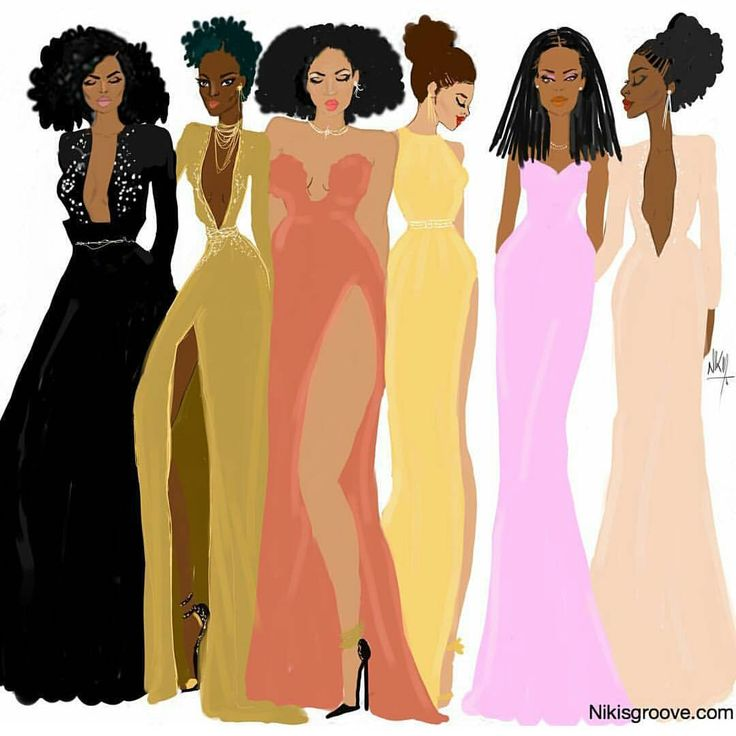
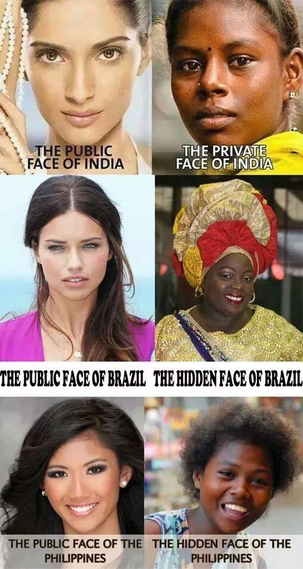
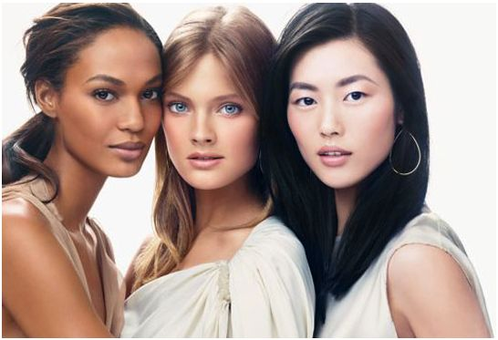
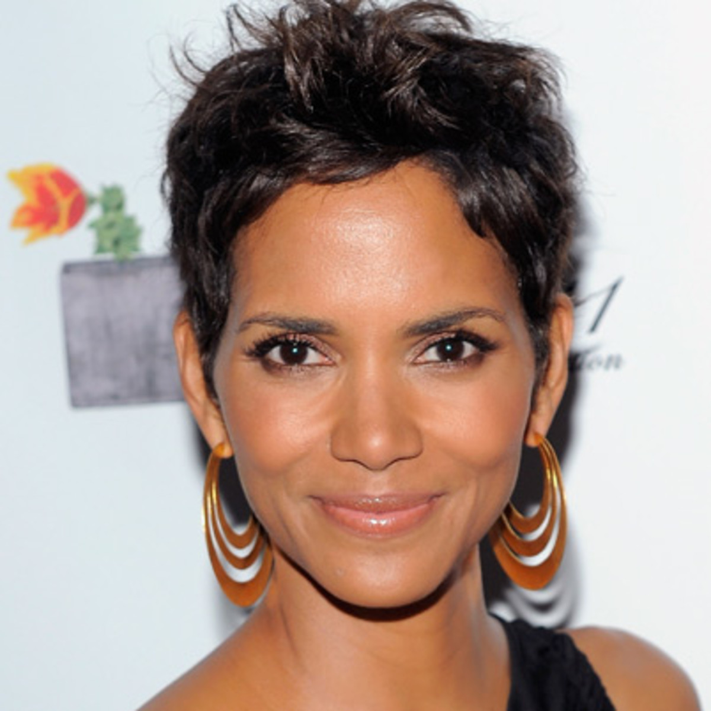
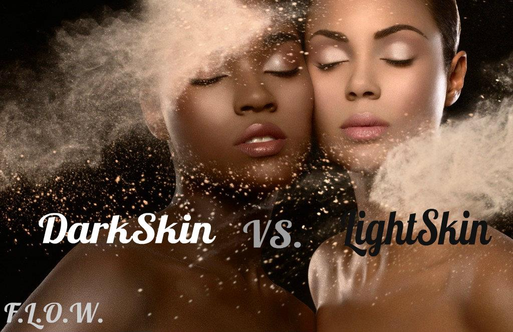

# Colorism


Colorism or shadeism is a form of prejudice, bias or discrimination based on skin complexion or pigmentation. This term is said to be coined by novelist Alice Walker in 1982. Colorism is a global issue which holds roots in colonialism, imperialism, slavery and globalization, institutions where white and western are superior. It is the social construction of a shade stratification that glorifies fairer skin tones and European standards of beauty. 


This phenomenon creates biases and prejudices among and within cultural groups of color especially. As racism subsists, colorism acts as its complement of oppression and bondage, to privilege light skin people while degrading whole communities of color. Colorism perpetuates stereotypes of social behavior associated with lighter and darker skin tones. It typically endorses the message that light skin people are more beautiful, wealthier, well-behaved and talented than their darker skinned counterparts. 


Colorism is projected in movies, t.v shows, music, advertising, education, financing, housing and more where more opportunity and preference is given to fairer persons.Colorism also impacts the white and western communities, where blonde hair and blue eyes can be superior to darker eyes and hair.  




This also means colorism has made its way to social media. Memes, hashtags, blog posts and articles work to both  disseminate and dismantle colorism propaganda.This project seeks to explore how colorism is perpetuated and discussed on social media, specifically on Twitter.
 
Around 2012 to 2013, hashtags and memes of terms Team Lightskin, Team Brownskin and Team Darkskin blew up on social media discussing color associated behaviors, stereotypes and prejudices relevant to topics like sports players, emotions, dating, beauty and more. The terms were used to categorize oneself and others based on skin color and then placed to compete, so debates like #TeamLightskin versus #TeamDarkskin were created. This occurred most specifically within the African-American/ Black Community so this will be my focus. 
 
Examples: A fair person could post a picture of himself and put #TeamLightskin; if a light skin and dark skin celebrity wore the same outfit or were up for the same award a meme or tweet could be made with the hashtag phrase #TeamLightskin v. #Team Darkskin
 
Today, these hashtags are used along with other keywords and phrases to perpetuate or discuss the obsession and oppression of shade stratification. Although, this still occurs, there is an even stronger movement to promote the beauty of people of color’s complexions and abolish colorism. There is a rise in hashtags used to callout colorism and popular hashtags that go further to unify the Black communities and highlight its collective achievements. 
 
I will be examining these phenomena through the use of word clouds of most used words associated with the respective hashtags or keywords accompanied by the tweets themselves. 

Take the time to examine the word clouds and tweets to understand how colorism is used in society on social media! 

#Tweets that Perpetuate Colorism
## Team Darkskin {.tabset .tabset-fade .tabset-pills}


### #TeamDarkskin Word Cloud

```{r thewordcloude, results='hide', echo=FALSE, message=FALSE, warning=FALSE}
##### EDIT SEARCH PARAMETERS BELOW

search_term <-"#teamdarkskin"  # For two terms use e.g. "compassion+love"
                             # For hashtags use e.g. "#compassion"
language <- "en"
sample_size <- 5000

##### EDIT SEARCH PARAMETERS ABOVE

# NEXT 4 LINES LOAD LIBRARIES OF FUNCTIONS
library(twitteR)
library(tm)
library(wordcloud)
library(RColorBrewer)

# NEXT LINE AUTHENTICATES SESSION WITH TWITTER
source("Nana_access.R")

####### EDIT THE NEXT LINE TO SPECIFY SEARCH
tweets_raw = searchTwitter(search_term, 
                          n=sample_size,
                          lang=language)
####### EDIT THE PREVIOUS LINE TO SPECIFY SEARCH

# NEXT TWO LINES REMOVES META-DATA THEN CONVERTS DATA TO A NEEDED FORMAT
tweets_text = sapply(tweets_raw, function(x) x$getText())
tweets_corpus = Corpus(VectorSource(tweets_text))

# NEXT LINE REMOVES SPECIAL CHARACTERS AVAILABLE IN OTHER LANGUAGES
tweets_transformed1 <- tm_map(tweets_corpus, 
                               content_transformer(function(x)                                                     iconv(x,to="UTF-8")))
                              
# NEXT LINE CONVERTS EVERYTHING TO LOWER CASE
tweets_transformed2 <- tm_map(tweets_transformed1,
                              content_transformer(tolower))
                             
# NEXT LINE REMOVES PUNCTUATION
tweets_transformed3 <- tm_map(tweets_transformed2,
                              removePunctuation)
                            
# NEXT LINE REMOVES "STOPWORDS" LIKE "THE", "AN", "IS", "BE", ETC.
tweets_transformed4 <- tm_map(tweets_transformed3,
                              function(x) removeWords(x,stopwords()))
                              
###### EDIT NEXT LINE TO SPECIFY DRAWING OF WORD CLOUD
wordcloud(tweets_transformed4, random.order=FALSE, colors=brewer.pal(8,"Dark2"))
```

### #TeamDarkskin 5000 Tweets

```{r darkskin, results='hide', echo=FALSE, message=FALSE, warning=FALSE}
tweets <- searchTwitter("#teamdarkskin", n=5000, lang="en")

for(i in 1:5000){
  print(tweets[[i]])
}
```


## Team Lightskin {.tabset .tabset-fade .tabset-pills}


### #TeamLightskin Word cloud 

```{r thewordcloudls, results='hide', echo=FALSE, message=FALSE, warning=FALSE}
##### EDIT SEARCH PARAMETERS BELOW
search_term <-"#TeamLightskin"  # For two terms use e.g. "compassion+love"
                             # For hashtags use e.g. "#compassion"
language <- "en"
sample_size <- 5000

##### EDIT SEARCH PARAMETERS ABOVE

# NEXT 4 LINES LOAD LIBRARIES OF FUNCTIONS
library(twitteR)
library(tm)
library(wordcloud)
library(RColorBrewer)

# NEXT LINE AUTHENTICATES SESSION WITH TWITTER
source("Nana_access.R")

####### EDIT THE NEXT LINE TO SPECIFY SEARCH
tweets_raw = searchTwitter(search_term, 
                          n=sample_size,
                          lang=language)
####### EDIT THE PREVIOUS LINE TO SPECIFY SEARCH

# NEXT TWO LINES REMOVES META-DATA THEN CONVERTS DATA TO A NEEDED FORMAT
tweets_text = sapply(tweets_raw, function(x) x$getText())
tweets_corpus = Corpus(VectorSource(tweets_text))

# NEXT LINE REMOVES SPECIAL CHARACTERS AVAILABLE IN OTHER LANGUAGES
tweets_transformed1 <- tm_map(tweets_corpus, 
                               content_transformer(function(x)                                                     iconv(x,to="UTF-8")))
                              
# NEXT LINE CONVERTS EVERYTHING TO LOWER CASE
tweets_transformed2 <- tm_map(tweets_transformed1,
                              content_transformer(tolower))
                             
# NEXT LINE REMOVES PUNCTUATION
tweets_transformed3 <- tm_map(tweets_transformed2,
                              removePunctuation)
                            
# NEXT LINE REMOVES "STOPWORDS" LIKE "THE", "AN", "IS", "BE", ETC.
tweets_transformed4 <- tm_map(tweets_transformed3,
                              function(x) removeWords(x,stopwords()))
                              
###### EDIT NEXT LINE TO SPECIFY DRAWING OF WORD CLOUD
wordcloud(tweets_transformed4, random.order=FALSE, colors=brewer.pal(8,"Dark2"))
```

### #TeamLightskin 5000 Tweets
```{r lightskind, results='hide', echo=FALSE, message=FALSE, warning=FALSE}
tweets <- searchTwitter("#TeamLightskin", n=5000, lang="en")

for(i in 1:5000){
  print(tweets[[i]])
}
```

## Team Brownskin {.tabset .tabset-fade .tabset-pills}


### #TeamBrownskin Word Cloud

```{r thewordcloudbr, results='hide', echo=FALSE, message=FALSE, warning=FALSE}
##### EDIT SEARCH PARAMETERS BELOW
search_term <-"#TeamBrownskin"  # For two terms use e.g. "compassion+love"
                             # For hashtags use e.g. "#compassion"
language <- "en"
sample_size <- 5000

##### EDIT SEARCH PARAMETERS ABOVE

# NEXT 4 LINES LOAD LIBRARIES OF FUNCTIONS
library(twitteR)
library(tm)
library(wordcloud)
library(RColorBrewer)

# NEXT LINE AUTHENTICATES SESSION WITH TWITTER
source("Nana_access.R")

####### EDIT THE NEXT LINE TO SPECIFY SEARCH
tweets_raw = searchTwitter(search_term, 
                          n=sample_size,
                          lang=language)
####### EDIT THE PREVIOUS LINE TO SPECIFY SEARCH

# NEXT TWO LINES REMOVES META-DATA THEN CONVERTS DATA TO A NEEDED FORMAT
tweets_text = sapply(tweets_raw, function(x) x$getText())
tweets_corpus = Corpus(VectorSource(tweets_text))

# NEXT LINE REMOVES SPECIAL CHARACTERS AVAILABLE IN OTHER LANGUAGES
tweets_transformed1 <- tm_map(tweets_corpus, 
                               content_transformer(function(x)                                                     iconv(x,to="UTF-8")))
                              
# NEXT LINE CONVERTS EVERYTHING TO LOWER CASE
tweets_transformed2 <- tm_map(tweets_transformed1,
                              content_transformer(tolower))
                             
# NEXT LINE REMOVES PUNCTUATION
tweets_transformed3 <- tm_map(tweets_transformed2,
                              removePunctuation)
                            
# NEXT LINE REMOVES "STOPWORDS" LIKE "THE", "AN", "IS", "BE", ETC.
tweets_transformed4 <- tm_map(tweets_transformed3,
                              function(x) removeWords(x,stopwords()))
                              
###### EDIT NEXT LINE TO SPECIFY DRAWING OF WORD CLOUD
wordcloud(tweets_transformed4, random.order=FALSE, colors=brewer.pal(8,"Dark2"))
```

### #TeamBrownskin 5000 Tweets
```{r brskin, results='hide', echo=FALSE, message=FALSE, warning=FALSE}
tweets <- searchTwitter("#TeamBrownskin", n=5000, lang="en")

for(i in 1:5000){
  print(tweets[[i]])
}
```

## Tweets Discussing Light skin and Dark skin terms together {.tabset .tabset-fade .tabset-pills}
The word cloud and tweets below contain both light skin and dark skin as terms.These tweets can either work to perpetuate colorism or discuss its debilitating effects. 


### Light and Dark Skin Terms Word Cloud 
```{r thewordcloudldr, results='hide', echo=FALSE, message=FALSE, warning=FALSE}
##### EDIT SEARCH PARAMETERS BELOW
search_term <-"light+skin+dark"  # For two terms use e.g. "compassion+love"
                             # For hashtags use e.g. "#compassion"
language <- "en"
sample_size <- 5000

##### EDIT SEARCH PARAMETERS ABOVE

# NEXT 4 LINES LOAD LIBRARIES OF FUNCTIONS
library(twitteR)
library(tm)
library(wordcloud)
library(RColorBrewer)

# NEXT LINE AUTHENTICATES SESSION WITH TWITTER
source("Nana_access.R")

####### EDIT THE NEXT LINE TO SPECIFY SEARCH
tweets_raw = searchTwitter(search_term, 
                          n=sample_size,
                          lang=language)
####### EDIT THE PREVIOUS LINE TO SPECIFY SEARCH

# NEXT TWO LINES REMOVES META-DATA THEN CONVERTS DATA TO A NEEDED FORMAT
tweets_text = sapply(tweets_raw, function(x) x$getText())
tweets_corpus = Corpus(VectorSource(tweets_text))

# NEXT LINE REMOVES SPECIAL CHARACTERS AVAILABLE IN OTHER LANGUAGES
tweets_transformed1 <- tm_map(tweets_corpus, 
                               content_transformer(function(x)                                                     iconv(x,to="UTF-8")))
                              
# NEXT LINE CONVERTS EVERYTHING TO LOWER CASE
tweets_transformed2 <- tm_map(tweets_transformed1,
                              content_transformer(tolower))
                             
# NEXT LINE REMOVES PUNCTUATION
tweets_transformed3 <- tm_map(tweets_transformed2,
                              removePunctuation)
                            
# NEXT LINE REMOVES "STOPWORDS" LIKE "THE", "AN", "IS", "BE", ETC.
tweets_transformed4 <- tm_map(tweets_transformed3,
                              function(x) removeWords(x,stopwords()))
                              
###### EDIT NEXT LINE TO SPECIFY DRAWING OF WORD CLOUD
wordcloud(tweets_transformed4, random.order=FALSE, colors=brewer.pal(8,"Dark2"))
```

### #Light and Dark Skin Terms 5000 Tweets
```{r lightdrskin, results='hide', echo=FALSE, message=FALSE, warning=FALSE}
tweets <- searchTwitter("light+dark+skin", n=5000, lang="en")

for(i in 1:5000){
  print(tweets[[i]])
}
```

##Colorism Discourse on Twitter {.tabset .tabset-fade .tabset-pills}

In recent years, the black community on Twitter, affectionately known as Black Twitter, has made great strides in colorism  discourse.Documentaries, celebrities and other Twitter users have worked to discuss the negativity and opression caused by colorism. Such discourse exposes the level of colorism and its obsession in soceity with the hopes of eradicating colorism. Below is the hashtag of colorism used to most directly engage this dialogue. 


### #Colorism Word Cloud

```{r thewordcloudclr, results='hide', echo=FALSE, message=FALSE, warning=FALSE}
##### EDIT SEARCH PARAMETERS BELOW
search_term <-"colorism"  # For two terms use e.g. "compassion+love"
                             # For hashtags use e.g. "#compassion"
language <- "en"
sample_size <- 5000

##### EDIT SEARCH PARAMETERS ABOVE

# NEXT 4 LINES LOAD LIBRARIES OF FUNCTIONS
library(twitteR)
library(tm)
library(wordcloud)
library(RColorBrewer)

# NEXT LINE AUTHENTICATES SESSION WITH TWITTER
source("Nana_access.R")

####### EDIT THE NEXT LINE TO SPECIFY SEARCH
tweets_raw = searchTwitter(search_term, 
                          n=sample_size,
                          lang=language)
####### EDIT THE PREVIOUS LINE TO SPECIFY SEARCH

# NEXT TWO LINES REMOVES META-DATA THEN CONVERTS DATA TO A NEEDED FORMAT
tweets_text = sapply(tweets_raw, function(x) x$getText())
tweets_corpus = Corpus(VectorSource(tweets_text))

# NEXT LINE REMOVES SPECIAL CHARACTERS AVAILABLE IN OTHER LANGUAGES
tweets_transformed1 <- tm_map(tweets_corpus, 
                               content_transformer(function(x)                                                     iconv(x,to="UTF-8")))
                              
# NEXT LINE CONVERTS EVERYTHING TO LOWER CASE
tweets_transformed2 <- tm_map(tweets_transformed1,
                              content_transformer(tolower))
                             
# NEXT LINE REMOVES PUNCTUATION
tweets_transformed3 <- tm_map(tweets_transformed2,
                              removePunctuation)
                            
# NEXT LINE REMOVES "STOPWORDS" LIKE "THE", "AN", "IS", "BE", ETC.
tweets_transformed4 <- tm_map(tweets_transformed3,
                              function(x) removeWords(x,stopwords()))
                              
###### EDIT NEXT LINE TO SPECIFY DRAWING OF WORD CLOUD
wordcloud(tweets_transformed4, random.order=FALSE, colors=brewer.pal(8,"Dark2"))
```

### #Colorism 5000 Tweets
```{r colorismn, results='hide', echo=FALSE, message=FALSE, warning=FALSE}
tweets <- searchTwitter("light+dark+skin", n=5000, lang="en")

for(i in 1:5000){
  print(tweets[[i]])
}
```

## Positive Hashtags that Promote the Beauty of All Shades {.tabset .tabset-fade .tabset-pills}


There are various hashtags that promote shade equality on Black Twitter. As previously mentioned, colorism is a counterpart of racisim, thereby perpetuated by the western world as well. Many of these tweets work to dismantle colorism and project the beauty of melanin. All women are subject to very high beauty standards and coupled with colorism, minority women especially face difficult challenges of self-esteem.Below are a series of hashtags and their wordclouds.These hashtags are all over social media and they are doing a fine job of overshadowing shade stratification and appreciating all the beauty in minorities, especially people of African descent.

### #BlackGirlMagic
```{r thewordcloudbdja, results='hide', echo=FALSE, message=FALSE, warning=FALSE}
##### EDIT SEARCH PARAMETERS BELOW
search_term <-"#blackgirlmagic"  # For two terms use e.g. "compassion+love"
                             # For hashtags use e.g. "#compassion"
language <- "en"
sample_size <- 5000

##### EDIT SEARCH PARAMETERS ABOVE

# NEXT 4 LINES LOAD LIBRARIES OF FUNCTIONS
library(twitteR)
library(tm)
library(wordcloud)
library(RColorBrewer)

# NEXT LINE AUTHENTICATES SESSION WITH TWITTER
source("Nana_access.R")

####### EDIT THE NEXT LINE TO SPECIFY SEARCH
tweets_raw = searchTwitter(search_term, 
                          n=sample_size,
                          lang=language)
####### EDIT THE PREVIOUS LINE TO SPECIFY SEARCH

# NEXT TWO LINES REMOVES META-DATA THEN CONVERTS DATA TO A NEEDED FORMAT
tweets_text = sapply(tweets_raw, function(x) x$getText())
tweets_corpus = Corpus(VectorSource(tweets_text))

# NEXT LINE REMOVES SPECIAL CHARACTERS AVAILABLE IN OTHER LANGUAGES
tweets_transformed1 <- tm_map(tweets_corpus, 
                               content_transformer(function(x)                                                     iconv(x,to="UTF-8")))
                              
# NEXT LINE CONVERTS EVERYTHING TO LOWER CASE
tweets_transformed2 <- tm_map(tweets_transformed1,
                              content_transformer(tolower))
                             
# NEXT LINE REMOVES PUNCTUATION
tweets_transformed3 <- tm_map(tweets_transformed2,
                              removePunctuation)
                            
# NEXT LINE REMOVES "STOPWORDS" LIKE "THE", "AN", "IS", "BE", ETC.
tweets_transformed4 <- tm_map(tweets_transformed3,
                              function(x) removeWords(x,stopwords()))
                              
###### EDIT NEXT LINE TO SPECIFY DRAWING OF WORD CLOUD
wordcloud(tweets_transformed4, random.order=FALSE, colors=brewer.pal(8,"Dark2"))
```

### #Melanin
```{r thewordcloudsadad, results='hide', echo=FALSE, message=FALSE, warning=FALSE}
##### EDIT SEARCH PARAMETERS BELOW
search_term <-"#melanin"  # For two terms use e.g. "compassion+love"
                             # For hashtags use e.g. "#compassion"
language <- "en"
sample_size <- 5000

##### EDIT SEARCH PARAMETERS ABOVE

# NEXT 4 LINES LOAD LIBRARIES OF FUNCTIONS
library(twitteR)
library(tm)
library(wordcloud)
library(RColorBrewer)

# NEXT LINE AUTHENTICATES SESSION WITH TWITTER
source("Nana_access.R")

####### EDIT THE NEXT LINE TO SPECIFY SEARCH
tweets_raw = searchTwitter(search_term, 
                          n=sample_size,
                          lang=language)
####### EDIT THE PREVIOUS LINE TO SPECIFY SEARCH

# NEXT TWO LINES REMOVES META-DATA THEN CONVERTS DATA TO A NEEDED FORMAT
tweets_text = sapply(tweets_raw, function(x) x$getText())
tweets_corpus = Corpus(VectorSource(tweets_text))

# NEXT LINE REMOVES SPECIAL CHARACTERS AVAILABLE IN OTHER LANGUAGES
tweets_transformed1 <- tm_map(tweets_corpus, 
                               content_transformer(function(x)                                                     iconv(x,to="UTF-8")))
                              
# NEXT LINE CONVERTS EVERYTHING TO LOWER CASE
tweets_transformed2 <- tm_map(tweets_transformed1,
                              content_transformer(tolower))
                             
# NEXT LINE REMOVES PUNCTUATION
tweets_transformed3 <- tm_map(tweets_transformed2,
                              removePunctuation)
                            
# NEXT LINE REMOVES "STOPWORDS" LIKE "THE", "AN", "IS", "BE", ETC.
tweets_transformed4 <- tm_map(tweets_transformed3,
                              function(x) removeWords(x,stopwords()))
                              
###### EDIT NEXT LINE TO SPECIFY DRAWING OF WORD CLOUD
wordcloud(tweets_transformed4, random.order=FALSE, colors=brewer.pal(8,"Dark2"))
```
### #Blackisbeautiful
```{r thewordcloud, results='hide', echo=FALSE, message=FALSE, warning=FALSE}
##### EDIT SEARCH PARAMETERS BELOW
search_term <-"#blackisbeautiful"  # For two terms use e.g. "compassion+love"
                             # For hashtags use e.g. "#compassion"
language <- "en"
sample_size <- 5000

##### EDIT SEARCH PARAMETERS ABOVE

# NEXT 4 LINES LOAD LIBRARIES OF FUNCTIONS
library(twitteR)
library(tm)
library(wordcloud)
library(RColorBrewer)

# NEXT LINE AUTHENTICATES SESSION WITH TWITTER
source("Nana_access.R")

####### EDIT THE NEXT LINE TO SPECIFY SEARCH
tweets_raw = searchTwitter(search_term, 
                          n=sample_size,
                          lang=language)
####### EDIT THE PREVIOUS LINE TO SPECIFY SEARCH

# NEXT TWO LINES REMOVES META-DATA THEN CONVERTS DATA TO A NEEDED FORMAT
tweets_text = sapply(tweets_raw, function(x) x$getText())
tweets_corpus = Corpus(VectorSource(tweets_text))

# NEXT LINE REMOVES SPECIAL CHARACTERS AVAILABLE IN OTHER LANGUAGES
tweets_transformed1 <- tm_map(tweets_corpus, 
                               content_transformer(function(x)                                                     iconv(x,to="UTF-8")))
                              
# NEXT LINE CONVERTS EVERYTHING TO LOWER CASE
tweets_transformed2 <- tm_map(tweets_transformed1,
                              content_transformer(tolower))
                             
# NEXT LINE REMOVES PUNCTUATION
tweets_transformed3 <- tm_map(tweets_transformed2,
                              removePunctuation)
                            
# NEXT LINE REMOVES "STOPWORDS" LIKE "THE", "AN", "IS", "BE", ETC.
tweets_transformed4 <- tm_map(tweets_transformed3,
                              function(x) removeWords(x,stopwords()))
                              
###### EDIT NEXT LINE TO SPECIFY DRAWING OF WORD CLOUD
wordcloud(tweets_transformed4, random.order=FALSE, colors=brewer.pal(8,"Dark2"))
```
### #Melaninpoppin
```{r thewordclouddafsfc, results='hide', echo=FALSE, message=FALSE, warning=FALSE}
##### EDIT SEARCH PARAMETERS BELOW
search_term <-"#melaninpoppin"  # For two terms use e.g. "compassion+love"
                             # For hashtags use e.g. "#compassion"
language <- "en"
sample_size <- 5000

##### EDIT SEARCH PARAMETERS ABOVE

# NEXT 4 LINES LOAD LIBRARIES OF FUNCTIONS
library(twitteR)
library(tm)
library(wordcloud)
library(RColorBrewer)

# NEXT LINE AUTHENTICATES SESSION WITH TWITTER
source("Nana_access.R")

####### EDIT THE NEXT LINE TO SPECIFY SEARCH
tweets_raw = searchTwitter(search_term, 
                          n=sample_size,
                          lang=language)
####### EDIT THE PREVIOUS LINE TO SPECIFY SEARCH

# NEXT TWO LINES REMOVES META-DATA THEN CONVERTS DATA TO A NEEDED FORMAT
tweets_text = sapply(tweets_raw, function(x) x$getText())
tweets_corpus = Corpus(VectorSource(tweets_text))

# NEXT LINE REMOVES SPECIAL CHARACTERS AVAILABLE IN OTHER LANGUAGES
tweets_transformed1 <- tm_map(tweets_corpus, 
                               content_transformer(function(x)                                                     iconv(x,to="UTF-8")))
                              
# NEXT LINE CONVERTS EVERYTHING TO LOWER CASE
tweets_transformed2 <- tm_map(tweets_transformed1,
                              content_transformer(tolower))
                             
# NEXT LINE REMOVES PUNCTUATION
tweets_transformed3 <- tm_map(tweets_transformed2,
                              removePunctuation)
                            
# NEXT LINE REMOVES "STOPWORDS" LIKE "THE", "AN", "IS", "BE", ETC.
tweets_transformed4 <- tm_map(tweets_transformed3,
                              function(x) removeWords(x,stopwords()))
                              
###### EDIT NEXT LINE TO SPECIFY DRAWING OF WORD CLOUD
wordcloud(tweets_transformed4, random.order=FALSE, colors=brewer.pal(8,"Dark2"))
```
### #Blackbeauty
```{r thewordcloud, results='hide', echo=FALSE, message=FALSE, warning=FALSE}
##### EDIT SEARCH PARAMETERS BELOW
search_term <-"#blackbeauty"  # For two terms use e.g. "compassion+love"
                             # For hashtags use e.g. "#compassion"
language <- "en"
sample_size <- 5000

##### EDIT SEARCH PARAMETERS ABOVE

# NEXT 4 LINES LOAD LIBRARIES OF FUNCTIONS
library(twitteR)
library(tm)
library(wordcloud)
library(RColorBrewer)

# NEXT LINE AUTHENTICATES SESSION WITH TWITTER
source("Nana_access.R")

####### EDIT THE NEXT LINE TO SPECIFY SEARCH
tweets_raw = searchTwitter(search_term, 
                          n=sample_size,
                          lang=language)
####### EDIT THE PREVIOUS LINE TO SPECIFY SEARCH

# NEXT TWO LINES REMOVES META-DATA THEN CONVERTS DATA TO A NEEDED FORMAT
tweets_text = sapply(tweets_raw, function(x) x$getText())
tweets_corpus = Corpus(VectorSource(tweets_text))

# NEXT LINE REMOVES SPECIAL CHARACTERS AVAILABLE IN OTHER LANGUAGES
tweets_transformed1 <- tm_map(tweets_corpus, 
                               content_transformer(function(x)                                                     iconv(x,to="UTF-8")))
                              
# NEXT LINE CONVERTS EVERYTHING TO LOWER CASE
tweets_transformed2 <- tm_map(tweets_transformed1,
                              content_transformer(tolower))
                             
# NEXT LINE REMOVES PUNCTUATION
tweets_transformed3 <- tm_map(tweets_transformed2,
                              removePunctuation)
                            
# NEXT LINE REMOVES "STOPWORDS" LIKE "THE", "AN", "IS", "BE", ETC.
tweets_transformed4 <- tm_map(tweets_transformed3,
                              function(x) removeWords(x,stopwords()))
                              
###### EDIT NEXT LINE TO SPECIFY DRAWING OF WORD CLOUD
wordcloud(tweets_transformed4, random.order=FALSE, colors=brewer.pal(8,"Dark2"))
```
### Terms Black with Beautiful
```{r thewordcloud, results='hide', echo=FALSE, message=FALSE, warning=FALSE}
##### EDIT SEARCH PARAMETERS BELOW
search_term <-"black+beautiful"  # For two terms use e.g. "compassion+love"
                             # For hashtags use e.g. "#compassion"
language <- "en"
sample_size <- 5000

##### EDIT SEARCH PARAMETERS ABOVE

# NEXT 4 LINES LOAD LIBRARIES OF FUNCTIONS
library(twitteR)
library(tm)
library(wordcloud)
library(RColorBrewer)

# NEXT LINE AUTHENTICATES SESSION WITH TWITTER
source("Nana_access.R")

####### EDIT THE NEXT LINE TO SPECIFY SEARCH
tweets_raw = searchTwitter(search_term, 
                          n=sample_size,
                          lang=language)
####### EDIT THE PREVIOUS LINE TO SPECIFY SEARCH

# NEXT TWO LINES REMOVES META-DATA THEN CONVERTS DATA TO A NEEDED FORMAT
tweets_text = sapply(tweets_raw, function(x) x$getText())
tweets_corpus = Corpus(VectorSource(tweets_text))

# NEXT LINE REMOVES SPECIAL CHARACTERS AVAILABLE IN OTHER LANGUAGES
tweets_transformed1 <- tm_map(tweets_corpus, 
                               content_transformer(function(x)                                                     iconv(x,to="UTF-8")))
                              
# NEXT LINE CONVERTS EVERYTHING TO LOWER CASE
tweets_transformed2 <- tm_map(tweets_transformed1,
                              content_transformer(tolower))
                             
# NEXT LINE REMOVES PUNCTUATION
tweets_transformed3 <- tm_map(tweets_transformed2,
                              removePunctuation)
                            
# NEXT LINE REMOVES "STOPWORDS" LIKE "THE", "AN", "IS", "BE", ETC.
tweets_transformed4 <- tm_map(tweets_transformed3,
                              function(x) removeWords(x,stopwords()))
                              
###### EDIT NEXT LINE TO SPECIFY DRAWING OF WORD CLOUD
wordcloud(tweets_transformed4, random.order=FALSE, colors=brewer.pal(8,"Dark2"))
```
LOVE THE SKIN YOU'RE IN! YOU'RE BEAUTIFUL! END COLORISM!